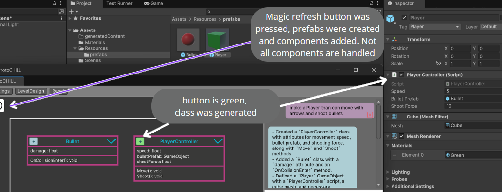

# ProtoCHILL - Unity Prototyping Package 

Protochill is a Unity package that allows for rapid prototyping using ChatGPT.

This package can help you start designing a game or analyze and help develop an existing one.

The main attraction is the UML Diagram that keeps track of your scripts and allow you to easily mock new Classes and structures.

This package is still in development and can run into bugs. It has the ability to write into your files. It is strongly advised to only use it on a project with a copy or saved version. Making Unity crash is not out of question either.

## Installing the package

I you don't have git, you need to install it to import the packages :
https://git-scm.com/downloads/win
You need to install git prior to opening Unity, or you will have to restart your Unity Project 

Advised Unity version is Unity 6 (see troubleshooting versions if you want to open a project in an other version)

If you want colors, Universal and Built-in render pipelines should work. 3D is strongly advised as of current version.
Once you have an opened Unity project :
1. Go to **Window > Package Manager**, click on the "+" button on the top left, then chose "install from git URL"
2. Add the [ChatGPT-Wrapper-For-Unity](https://github.com/GraesonB/ChatGPT-Wrapper-For-Unity) from GIT URL : paste the link https://github.com/GraesonB/ChatGPT-Wrapper-For-Unity.git
3. Add the [ProtoChill Package](https://github.com/jouliet/UnityProtoChill) from GIT URL : paste the link https://github.com/jouliet/UnityProtoChill.git
4. Go to **Window > ProtoChill** to start using the tool. At this point clicking (once or twice... be patient) the Magic Refresh button on the top left should load your local classes in the Assets/Scripts folder.
5. In the Protochill window go to settings, put your API key and click init. Your key will be saved in the Application.PersistentDataPath which is local to your machine but watch out.

## Using the package on an existing game
1. Make a copy of your project or have it versioned (no issue has ever happened yet but you don't want to be that guy).
2. Make sure your scripts are in the Assets/Scripts folder. You should consider moving your scripts there.
3. Begin by hitting the refresh button a few times so your classes load in the UML Diagram. If they haven't, see troubleshooting.
4. All your classes should appear with their composition links (heritage is not handled), their fields and methods. The "+" button should be green. You can now use the tool. Selecting a class in the Diagram will make you able to regenerate it's script. This will rewrite the file with a GPT Output that has no garantee of working. 
5. It's strongly advised to have one class per file

## Using the package to build a game
1. Chat Section : you may enter a message and submit it to GPT for him to create a UML Structure for you future game
2. Diagram Section : the diagram reflects the structure of the scripts of your game. If the "+", is green, the script has been generated. Otherwhise, see 3.
3. Script generation : you can generate scripts by hitting the "+" on a class in the diagram, and then "generate script" to generate it. If you want better script generation, see 4.
4. Better script generation : If you want to describe the specific behavior of a script before generating it, begin by clicking on the script you want to generate on the diagram. It should light up and the chat box should say "Generating script for...". You can now describe the behavior you want before pressing submit.
5. Script indicator : the "+" will turn green if the script was successfully generated and resolved by the package. This is also true for a script that you have written : a class will appear with a green + on the diagram. 
6. Memory warning : Any class that isn't green has no script and no permanence depending on the operations you execute. If you want to keep a class it is strongly advised to generate it. Generating every class with the "+" button and no context is a good practice that will create mocks that you can regenerate with context at any ulterior moment.

## Using the Package to it's full potential

The context given to GPT when generating is the script you are trying to regenerate, the Class fields and methods as described in the UML and the class fields and methods of it's direct composed classes. 
It is advised :
- To make the Diagram's Class have the important fields (such as a reference to a prefab with the correct name shown in the UML) before generating the script.
- Not to use heritage (not in the context, you may add relevant parent classes directly in chatbox)
- To program in a "Top down" manner : High level class handles sub classes etc, with no loops of compositions
- Not to use static variables (not in the context, you may add relevant static variables directly in chatbox)

## TroubleShooting versions 

If you are really into it you can go to the package Protochill files and Ctrl + K + C all the insides of the methods that use things that are unresolved. You will lose a few functionalities and this might take a while for not much depending on how old your version.

Don't do it, make a copy of your project and change the Unity version to Unity 6 from Unity hub and then click yes to everything Unity asks you. If your project can't seem to work on Unity 6 refer back to previous paragraph.

## Some prompt ideas to get started :

When starting from scratch, simply ask him something like "make a simple platformer game" 

If you already have a data structure, you may Begin by asking "What do you think of my structure ? I want to implement this new functionality that i'm currently describing and that does crazy stuff. Please help me by adding relevant classes and gameObjects

## Thank you

To [ChatGPT-Wrapper-For-Unity](https://github.com/GraesonB/ChatGPT-Wrapper-For-Unity) our main dependency, which handles OpenAI API Requests formatting. 